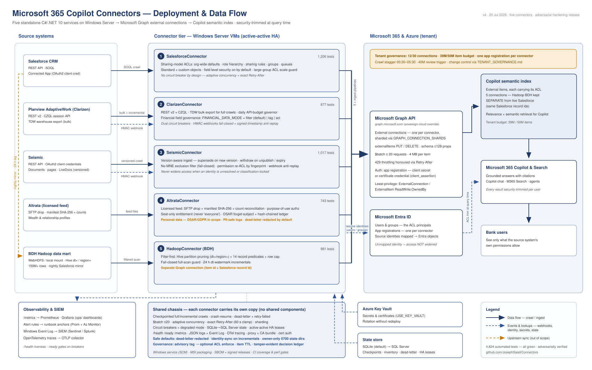

# Connectors

Microsoft 365 Copilot **Graph connectors** for enterprise source systems, built
on a shared, production-hardened C#/.NET 10 chassis. Each connector has its own
solution, tests, config, docs and Docker image and lives in its own top-level
folder; all five reference the one `Connector.Chassis/` project in this repo,
and CI runs from the workflows at the repository root.



| Connector | Source system | Highlights | Tests |
|---|---|---|---|
| [SalesforceConnector](SalesforceConnector/) | Salesforce CRM | Sharing-model ACLs, standard + custom objects, sovereign-cloud ready, large-group ACL scale guard | 1213 |
| [ClarizenConnector](ClarizenConnector/) | Planview AdaptiveWork (Clarizen) | REST v2 + TDW bulk, financial-field governance (filter by default), webhooks with anti-replay | 929 |
| [SeismicConnector](SeismicConnector/) | Seismic (sales enablement) | Version-aware, fail-closed No-MNE exclusion filter, usage ranking, webhook anti-replay | 1025 |
| [AltrataConnector](AltrataConnector/) | Altrata (relationship & wealth intelligence) | Licensed feeds, seat-only entitlement, purpose-of-use authz, DSAR erasure | 764 |
| [HadoopConnector](HadoopConnector/) | BDH Hadoop data mart (nightly Salesforce mirror) | Filter-first at 150M+ scale, partition pruning, 24h-lag aware | 1021 |

## Shared chassis

`Connector.Chassis/` (v1.19.0) is one real shared project: all five connectors
consume it via `<ProjectReference>`. It is not a NuGet package — there is no
version pinning and no feed. `.github/workflows/conformance.yml` asserts that
reference on every PR by resolving it through the csproj XML to a file on disk,
so "on the fleet" is checked rather than claimed.

Sharing is partial, and tracked rather than estimated. Of the chassis's 23
modules, **10 have no local copy anywhere** — `Chassis` (identity/seams),
`ServiceStop`, `SecretProvider`, `MetricsRenderer`, `SqlGateway`,
`CircuitBreakerRegistry`, `ConfigException`, `LogRedaction`,
`StandardLogDialect` and `EnvFlags`. The other 13 still exist as per-connector
implementations: `DecisionLedger`, `EventLogSink`, `HaCoordinator`, `LogPruner`,
`ServiceHost` and `SqlStateStore` in four connectors each; `CircuitBreaker` in
three; `Tracing` in two; `Alerting`, `HttpTransport`, `Logging`,
`SecureDirectory` and `SqlExecutor` in one.

`EnvFlags` was the most recent to consolidate, and it is the one case where the
divergence was not merely duplication: Clarizen, Hadoop and Salesforce were
still carrying the parser from *before* the fleet's boolean vocabulary was
hardened, so a security-relevant fix applied to the chassis had never reached
them (`Connector.Chassis/CONSOLIDATION.md`).

That comes to **64 declared divergences** — Salesforce 21, Clarizen 15,
Hadoop 15, Altrata 13, **Seismic 0** — each recorded with a reason in
[`.github/conformance/divergences.tsv`](.github/conformance/divergences.tsv).
The register is a ratchet, not an amnesty: CI fails on a local copy that is not
declared, and equally on a declared copy that no longer exists, so the number
cannot drift and cannot quietly grow. Where a connector keeps its own contract
the chassis exposes a seam instead of forking — `Chassis.LoggerFactory` (how
Salesforce's CPython-style logging stack participates at all),
`Logging.Dialect`, and `Alerting.HandlerFactory` (each connector keeps the HTTP
transport it was hardened with).

Every connector ships the same foundation:

- Unified CLI (`guide`, `setup-connection`, `full-deployment`, `ingest`,
  `reconcile`, `validate-config`, …)
- Checkpointed full + incremental crawls with crash/stop resume
- Dead-letter queue + `retry-failed`; Graph `$batch` ingest with adaptive
  concurrency and exact `Retry-After` handling; connection sharding
- SQLite / SQL Server state, active-active HA leases, Azure Key Vault secrets
- `/health` `/ready` `/metrics`, structured JSON logs, OpenTelemetry tracing
- Circuit breakers with degraded-mode fail-safe
- Unified data classification & sensitivity tagging (Public → Restricted) — an
  advisory connector-applied tag, with optional ACL enforcement of the top tier
- SCM-aware Windows service, Docker image, GitHub Actions CI — fourteen
  workflows at the repository root: one per connector (build + test on ubuntu
  **and** windows, plus a Docker image build), one for the chassis (build, test,
  pack), CodeQL, the chassis conformance gate, and the release pipeline (one
  reusable workflow plus a caller per connector — see [Releasing](#releasing)).
  `main` is protected: linear history, no force-push, and the two checks that
  run on every PR (`Chassis conformance`, `Analyze (csharp)`) are required,
  admins included
- Enterprise operations pack: Windows Event Log/SIEM integration, corporate
  proxy + TLS-inspection CA support, certificate-credential Graph auth,
  threat model, runbooks, DR plan, Grafana dashboards + alert rules (see each
  connector's "Enterprise operations" README section). SBOM generation, MSI
  packaging and release signing run from the repository root — see
  [Releasing](#releasing).
- Bank-grade hardening — privacy- and compliance-safe defaults out of the box:
  dead-letter payload redaction by default, entitlement re-sync on incremental
  crawls, owner-only (0700) state directories, stale-index item TTL
  (`expirationDateTime`), signed-timestamp webhook anti-replay, purpose-of-use
  authorization (Altrata), and a tamper-evident hash-chained decision ledger

See each connector's own `README.md` for source-specific features, environment
variables, deployment and hardware guidance.

All five share one tenant's Graph quotas (30 connections, 50M indexed items):
[TENANT_GOVERNANCE.md](TENANT_GOVERNANCE.md) allocates connections, item
budgets, app registrations and crawl windows across the fleet.

Operator documentation (deploy / monitor / troubleshoot / support), written for
IT operators, lives in [Operator_Guides/](Operator_Guides/) — start with
`00_START_HERE.pdf`, then the Tenant & Common Concepts guide, then your
connector's guide.

## Build & test a connector

```bash
cd <Connector>            # e.g. SalesforceConnector
dotnet build
dotnet test
```

Requires the .NET 10 SDK. Deployment target is Windows Server (service mode);
the code is cross-platform for development.

Docker images build with the repository root as the build context, because each
connector references `../Connector.Chassis`:

```bash
docker build -f <Connector>/Dockerfile .
```

## Releasing

Connectors version and ship **independently**, so release tags are prefixed per
connector rather than shared. Pushing a tag runs the full pipeline for exactly
one connector:

| Connector | Tag | Image |
|---|---|---|
| SalesforceConnector | `salesforce-v1.2.0` | `ghcr.io/<owner>/salesforce-copilot-connector` |
| ClarizenConnector | `clarizen-v1.2.0` | `ghcr.io/<owner>/clarizen-connector` |
| SeismicConnector | `seismic-v1.2.0` | `ghcr.io/<owner>/seismic-connector` |
| AltrataConnector | `altrata-v1.2.0` | `ghcr.io/<owner>/altrata-connector` |
| HadoopConnector | `hadoop-v1.2.0` | `ghcr.io/<owner>/hadoop-connector` |

A fleet-wide `v*` tag is deliberately **not** used: it would start all five
pipelines against one tag, and only the first to finish could create the
release.

Each tag build gates on the connector's full suite (ubuntu **and** windows),
then produces a CycloneDX SBOM, self-contained single-file `win-x64` and
`linux-x64` bundles with SHA-256 checksums, a GHCR image, an experimental WiX
MSI, and a GitHub release with the bundles and SBOM attached.

The logic lives once in
[`.github/workflows/release-connector.yml`](.github/workflows/release-connector.yml);
the five `release-<connector>.yml` callers supply only paths and names.

**Dry run before tagging.** Every caller also accepts `workflow_dispatch`, which
takes the identical build → smoke-test → package path but pushes nothing and
creates no release:

```bash
gh workflow run release-salesforce.yml
```

**Signing is optional.** All four secrets below are absent by default; each
signing step skips with a `::notice::` and the release still ships (unsigned),
so forks and dry runs never fail on missing credentials.

| Secret | Signs |
|---|---|
| `AUTHENTICODE_PFX_BASE64` / `AUTHENTICODE_PFX_PASSWORD` | the `win-x64` binary (timestamped Authenticode) |
| `COSIGN_PRIVATE_KEY` / `COSIGN_PASSWORD` | the GHCR image, by digest |
