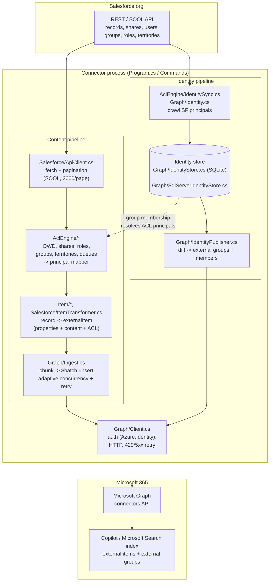
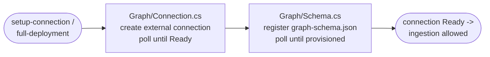
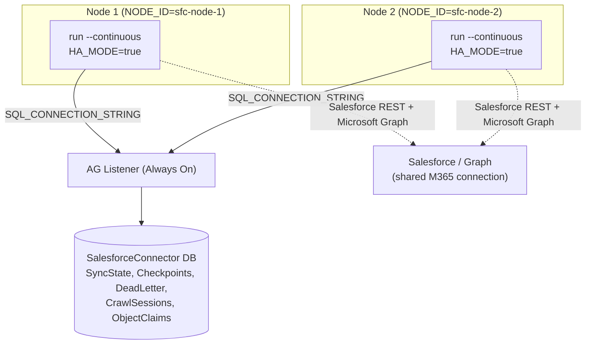
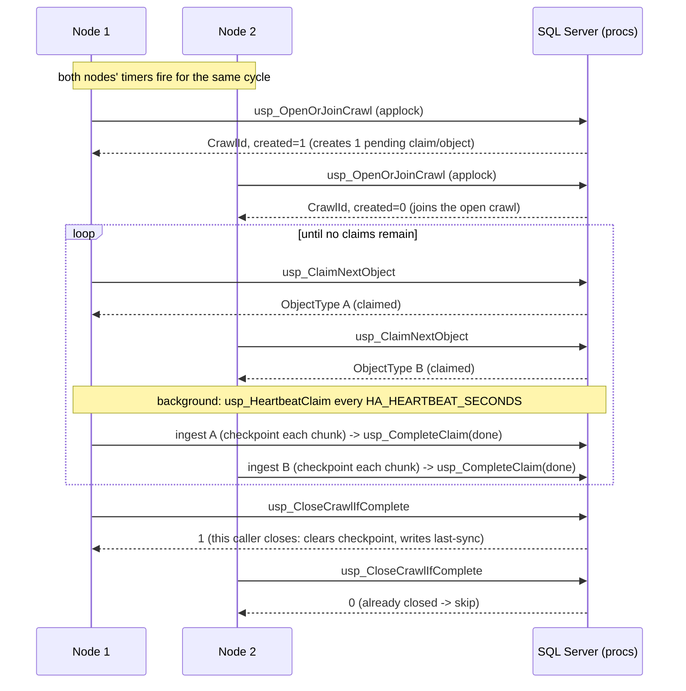

# Architecture

How the Salesforce Copilot Connector is put together: the components, how data
flows from Salesforce into the Microsoft 365 Copilot index, where state lives,
and how the active-active HA cluster coordinates through SQL Server.

Companion docs: [RUNBOOK.md](RUNBOOK.md) (operations),
[HA.md](HA.md) + [SQL_CONTRACT.md](SQL_CONTRACT.md) (HA/SQL contract),
[RETRY.md](RETRY.md) (throttling), [CAPACITY.md](CAPACITY.md) (sizing),
[ACL_PERMISSION_DFD.md](ACL_PERMISSION_DFD.md) (permission model).

---

## 1. Component & data-flow diagram

Two pipelines share one process: the **content pipeline** (records → indexed
external items) and the **identity pipeline** (Salesforce principals → external
groups). Group-based ACLs stitch them together — the identity crawl publishes the
groups that the content pipeline references in each item's ACL.

Setup (run once by `setup-connection` / the first `full-deployment`) provisions
the external connection and schema before any ingestion:

---

## 2. Components & responsibilities

Namespaces map 1:1 to `src/SalesforceCopilotConnector/` folders; rows marked
*shared chassis* live in the repository-root `Connector.Chassis/` project, which
this connector consumes by `<ProjectReference>`.

| Area | Namespace / key files | Responsibility |
|---|---|---|
| CLI / entry | `Program.cs`, `Commands/CommandRegistry.cs` | argparse-replica parser; dispatch to command handlers |
| Commands | `Commands/Deploy.cs`, `IngestCommand.cs`, `SetupConnection.cs`, `IdentityDryRun.cs`, `IngestItem.cs`, `IngestObject.cs`, `RetryFailed.cs`, `Guide.cs` | one file per CLI verb (`full-deployment`, `ingest`, `setup-connection`, `identity-dry-run`, `ingest-item`, `ingest-object`, `retry-failed`, `guide`) |
| Config load | `Salesforce/Settings.cs` | read env + `config/*.json`, build `AppConfig`, validate `CONNECTOR_ID`, env aliasing |
| Salesforce | `Salesforce/ApiClient.cs`, `ItemTransformer.cs`, `SharingModel.cs`, `Utils.cs` | OAuth client-credentials auth, SOQL + pagination, sharing model, record shaping |
| ACL engine | `AclEngine/*` — `OrgWideDefaults.cs`, `ShareFetcher.cs`, `RoleHandler.cs`, `GroupHandler.cs`, `TerritoryHandler.cs`, `QueueHandler.cs`, `UserHandler.cs`, `PrincipalMapper.cs`, `GroupAclBuilder.cs`, `Resolver.cs`, `IdentitySync.cs` | resolve who may see each record; map SF principals → M365/group principals |
| Legacy ACL | `Graph/LegacyAclResolver.cs`, `Graph/Acl.cs` | pre-rewrite resolver, used when `USE_NEW_ACL_ENGINE=false` |
| Item transform | `Item/ItemConverter.cs`, `Converter.cs`, `Models.cs`, `ItemModels.cs` | record + resolved ACL → `externalItem` (properties, content, acl) |
| Graph ingest | `Graph/Ingest.cs`, `Graph/Client.cs`, `Graph/RetryDelay.cs` | chunking, `$batch` upsert, adaptive concurrency, 429/5xx retry ([RETRY.md](RETRY.md)) |
| Connection/schema | `Graph/Connection.cs`, `Graph/Schema.cs`, `Graph/GraphModule.cs` | create/provision the external connection + schema |
| Identity store | `Graph/IdentityStore.cs` (SQLite), `Graph/SqlServerIdentityStore.cs`, `Graph/IIdentityStore.cs`, `IdentityPublisher.cs`, `Graph/Identity.cs` | persist groups/members + crawl history; publish external groups |
| State | `Config/SyncState.cs` (files), `Config/SqlStateStore.cs` (SQL) | last-sync timestamp, per-object checkpoints, dead-letter queue |
| HA | `Infrastructure/HaCoordinator.cs` | crawl open/join, claim/heartbeat/complete, close ([SQL_CONTRACT.md](SQL_CONTRACT.md)) |
| SQL plumbing | `Infrastructure/SqlExecutor.cs` | hardened `SqlConnection` (force `Encrypt`, optional Managed Identity), transient-fault retry (`SQL_MAX_RETRIES`) |
| Secrets | `Connector.Chassis/SecretProvider.cs` (shared chassis) | `SECRET_*` from env or Key Vault (`USE_KEY_VAULT`) |
| Hosting | `Infrastructure/ServiceHost.cs`, `Connector.Chassis/ServiceStop.cs` (shared chassis) | Windows-service (SCM) lifetime + graceful stop |
| Ops | `Infrastructure/Logging.cs` (+ `LOG_FORMAT`), `LogPruner.cs` (`LOG_RETENTION_DAYS`), `Dashboard.cs` | logging, run-dir pruning, live TUI |

> Observability seams — `/health`, `/ready`, `/metrics` (`HEALTH_PORT`) and
> webhook alerting (`ALERT_WEBHOOK_URL`) — are documented in
> [OBSERVABILITY.md](OBSERVABILITY.md).

---

## 3. State stores — what lives where

Two backends, selected by `USE_SQL_SERVER`. Everything is byte-compatible with
the Python original in file/SQLite mode.

| State | File / SQLite mode (default) | SQL Server mode (`USE_SQL_SERVER=true`) |
|---|---|---|
| Last-sync timestamp | `logs/sync_state.json` | `SyncState` table (`usp_Read/WriteLastSync`) |
| Per-object checkpoints (chunk index + `since`) | `logs/checkpoint_{CONNECTOR_ID}.json` | `Checkpoints` table (`usp_Read/WriteCheckpoint`) |
| Dead-letter queue (failed items) | `logs/failed_records_{CONNECTOR_ID}.jsonl` | `DeadLetter` table (`usp_Append/Read/ClearDeadLetter`) |
| Identity groups + members | `data/{CONNECTOR_ID}_identity.db` (SQLite) | `Groups` / `GroupMembers` tables |
| Crawl audit / session stats | `sync_sessions` in the SQLite db | `SyncSessions` table |
| HA crawl coordination | n/a (single node only) | `CrawlSessions` / `ObjectClaims` tables |
| Run logs | `logs/{prefix}_{yyyyMMdd_HHmmss}/` | same (logs stay on each node's disk) |

Notes:
- **Logs are always local** to each node, even in SQL/HA mode. Only the
  coordinating state moves to SQL.
- In SQL mode the root files above are unused; `LOG_RETENTION_DAYS` prunes old
  run directories on every node and SQL history via `usp_PruneHistory`. The root
  state files are never deleted by pruning.
- The full table/view/proc contract is [SQL_CONTRACT.md](SQL_CONTRACT.md).

---

## 4. Sync lifecycle

### Commands
- `setup-connection` — create the external connection + register the schema
  (idempotent; poll until Ready). No ingestion.
- `full-deployment` — `setup-connection`, then (if group ACLs) an identity crawl,
  then a full content ingest. `--continuous` keeps the process running on a timer.
- `ingest` — re-ingest content only (connection must already exist).
  `--continuous` supported.
- `ingest-object --type <T>` / `ingest-item --id <ID>` — targeted single-object /
  single-record ingest (debugging).
- `identity-dry-run [--save]` — preview identity changes; `--save` writes the
  crawl to the identity store without calling Graph.
- `retry-failed [--file <path>] [--clear-on-success]` — re-push dead-lettered
  items.

### Full vs incremental (continuous mode)
Each node keeps its own timer:
- **Full content crawl** every `--full-crawl-hours` (default 24, min 12) — walks
  every object type from scratch.
- **Incremental content crawl** every `--incremental-hours` (default 4, min 1) —
  only records changed since the last successful sync (`SystemModstamp` boundary).
- **Identity crawl** always runs as a *full* crawl on full cycles. By default it
  is skipped on incremental cycles; set `IDENTITY_SYNC_ON_INCREMENTAL=true` to run
  it on incrementals too (uses the identity store's last-session watermark).

### Checkpoints, dead-letter, resume
- Each object type is ingested in chunks of `INGEST_CHUNK_SIZE`; after each chunk
  the connector writes a **checkpoint** (object type → last completed chunk index,
  plus the `since` boundary).
- A restart (crash, service stop, SQL failover) **resumes from the last
  checkpoint** — completed chunks are skipped, nothing is re-sent unnecessarily.
  Graceful stop (Windows-service stop / dashboard Ctrl+X) finishes the in-flight
  chunk, flushes the pending `$batch`, and checkpoints before exiting.
- Items whose `$batch` sub-request ultimately fails after retries are appended to
  the **dead-letter queue** (JSONL file or `DeadLetter` table). They do not block
  the crawl. Re-drive them later with `retry-failed`.
- On a clean full crawl completion the checkpoint is cleared and the last-sync
  timestamp advanced.

### Throttling
Graph throttles per external connection. `Graph/Ingest.cs` retries throttled
`$batch` sub-requests honouring `Retry-After` (capped 60s) and dials worker
concurrency down on 429s / back up after clean batches. Details and the
`GRAPH_RETRY_JITTER` HA recommendation are in [RETRY.md](RETRY.md); throughput
ceilings are in [CAPACITY.md](CAPACITY.md).

---

## 5. Active-active HA

With `HA_MODE=true` (requires `USE_SQL_SERVER=true`), two or more nodes run the
**same** `--continuous` command against **one** database (point
`SQL_CONNECTION_STRING` at the AG listener) and coordinate entirely in SQL. HA
buys availability and crawl-window resilience — **not** throughput (the Graph 429
quota is per connection and shared; see [CAPACITY.md](CAPACITY.md) §5).

Crawl / claim / heartbeat lifecycle (each cycle):

Failover: if a node dies mid-object its heartbeat goes stale; after
`HA_CLAIM_TIMEOUT_SECONDS` another node's `usp_ClaimNextObject` reclaims that
object and **resumes from its SQL checkpoint**. A node whose cycle comes due after
the crawl already closed (and last-sync is fresher than its due time) skips the
cycle. Full failure-mode table and the failover drill: [HA.md](HA.md).

---

## 6. ACL model summary

Every external item carries an ACL granting/denying M365 principals. Resolution
per record:

1. **Org-Wide Default (OWD)** for the object (`AclEngine/OrgWideDefaults.cs`;
   overridable via `OWD_OVERRIDES`, or read from EntityDefinition when
   `USE_ENTITY_DEFINITION_OWD=true`) sets the baseline — `Public` grants everyone,
   `Private` grants only the explicitly-shared principals.
2. **Sharing rows** (`ShareFetcher.cs`) plus **role hierarchy**
   (`RoleHandler.cs`), **public groups / queues** (`GroupHandler.cs`,
   `QueueHandler.cs`), **territories** (`TerritoryHandler.cs`), and the record
   **owner** (`UserHandler.cs`) contribute additional grants.
3. `ControlledByParent` objects inherit their parent's ACL, walking up to
   `ACL_MAX_PARENT_DEPTH` levels.
4. `PrincipalMapper.cs` maps each Salesforce principal to a Graph principal —
   users to M365 users, groups/roles/territories/queues to **external groups**
   published by the identity pipeline (`GroupAclBuilder.cs` when
   `USE_GROUP_ACL=true`).

`USE_NEW_ACL_ENGINE=false` falls back to `Graph/LegacyAclResolver.cs`. The full
data-flow diagram, object-by-object, is in
[ACL_PERMISSION_DFD.md](ACL_PERMISSION_DFD.md).

Concurrency & caching notes (one resolver/mapper instance is shared across the
parallel object workers started by `Graph/Ingest.cs`):

- `PrincipalMapper.cs` and `ShareFetcher.cs` keep their principal / user-detail
  / owner / share-field caches in `ConcurrentDictionary`s so the slow
  (cache-miss) paths are safe under concurrent resolution; the once-per-type
  missing-parent warning in `Resolver.cs` is lock-guarded for the same reason.
  `PrincipalMapper.ResolveIdentifierAsync` additionally collapses concurrent
  cache misses for the *same* identifier onto a single in-flight Graph lookup.
- `ShareFetcher.PrewarmChunkAsync()` pre-seeds an empty owner/share result for
  every record so records with genuinely zero shares skip the per-record SOQL.
  A **transient** (non-`INVALID_FIELD`) bulk-query failure drops those seeded
  blanks for the affected batch, so `GetOwnerIdAsync` / `GetShareEntriesAsync`
  fall back to the per-record slow path instead of silently indexing the batch
  owner-less / deny-all. Successfully queried records keep the fast path.
- `QueueHandler.PrewarmAsync()` bulk-loads all `GroupMember` rows once per run;
  static group/queue expansion is then a pure in-memory DFS with **zero
  per-group SOQL**. If the prewarm query fails, expansion falls back to one
  SOQL per group node. (`_groupMembers` is `volatile` — written once under the
  prewarm lock, read lock-free on the hot path.)
- Group expansion is cycle-safe in both engines: `QueueHandler.cs` and
  `Graph/LegacyAclResolver.cs` track visited groups, so cyclic memberships
  (A → B → A) terminate, with the cyclic reference contributing no extra
  grants. In `LegacyAclResolver` only the nodes **strictly inside** a cycle are
  left uncached; the back-edge target and any heavily-shared group above the
  cycle still compute their full closure and are cached (no per-record
  re-expansion).

---

## 7. Extension points

| To… | Do this |
|---|---|
| Sync more objects/fields | Edit `config/schema.json` (object list, fields, `owdField`, parent map). No code change — `Settings.cs` reads it at load. |
| Change the search schema | Edit `config/graph-schema.json` (Graph external-connection schema). Reprovision the connection. |
| Change result rendering | Edit `config/template.json` (Adaptive Card). |
| Swap the state backend | `USE_SQL_SERVER` toggles `Config/SqlStateStore.cs` + `Graph/SqlServerIdentityStore.cs`. New backends implement `Graph/IIdentityStore.cs` and the `SyncState` surface. |
| Source secrets differently | `Connector.Chassis.SecretProvider.GetSecret` (env → Key Vault via `USE_KEY_VAULT`) — shared across connectors, so changes land everywhere. |
| Harden/redirect SQL | `Infrastructure/SqlExecutor.cs` (Managed Identity, retry policy). |
| Scale past one connection | `GRAPH_CONNECTION_SHARDS` — per-connection schemas ([CAPACITY.md](CAPACITY.md) §6). |
| Add an ACL principal type | Add a handler under `AclEngine/` and wire it into `Resolver.cs` / `PrincipalMapper.cs`. |
| Structured logs / health / alerts | `LOG_FORMAT`, `HEALTH_PORT`, `ALERT_WEBHOOK_URL` ([OBSERVABILITY.md](OBSERVABILITY.md)). |
